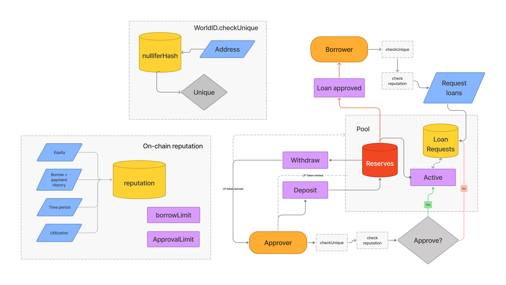

# Medici Finance

Providing uncollateralized loans using on-chain reputation.

Medici-finance is a Defi lending project which allows you to take loans without posting collateral based on your on-chain reputation. It does so by having a lending pool between borrowers and approvers with on-chain reputation connected to your WorldID.

## How does it work?

Borrowers can request a loan from one consolidated pool and register their WorldID in the process. Approver who have staked in the pool can approve their loans judging by their reputation score and grant the loan to borrower. If this loan doesn't get paid back with 20% APR interest in 30 days, the borrower gets blacklisted and can never borrow again and the approver's stake get slashed by the borrow amount and impacts his/her reputation. Only way to increase your reputation is to take loans and repay them back aptly while keeping the utilization ratio low like with a normal credit score.

## How is it made?

This project uses WorldCoin for the WorldID and Polygon to deploy on. We use CheckWorldID to check for unique loan requests. In the future, we'll use Chainlink keepers to slash/liquidate approvers and graph for checking on-chain reputation.
